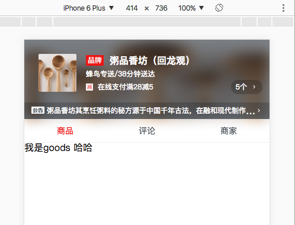

# sell

> sell app

## Build Setup

``` bash
# install dependencies
npm install

# serve with hot reload at localhost:8080
npm run dev

# build for production with minification
npm run build

# run unit tests
npm run unit

# run e2e tests
npm run e2e

# run all tests
npm test
```

## branch 分支说明
- first-version 最原始版，未进行组件封装 【2017-06-26】
- second-version 对header组件进行外部封装，包括数据异步获取，布局，样式等 【2017-06-26】
  主要用到的知识点：
  - 1：异步获取数据 vue-resource 插件
  - 2: stylus 语法
  - 3: 组件布局样式，先写每个元素的class类，最后再实现每个具体的css样式
  - 4：CSS的 display的inline-block区块定义，vertical-align的top垂直居中， position定位, rgba半透明, blur背景图模糊，border-radius 半圆角



